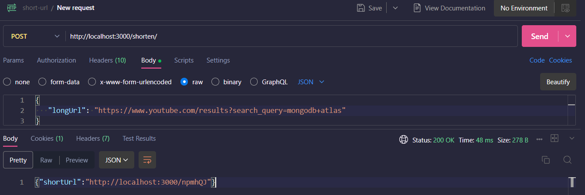

Here’s a complete update for your project as per your request:

---
##  Live Demo

-  **webpage:** [https://your-frontend-url.vercel.app](https://short-url-webapp-pjsh.vercel.app)

## Web Page Screen short


1.  structure including frontend and backend folders
2. Updated `README.md` with backend file structure
3. `Project Goal` rewritten in **React JSX**

---

###  `@workspace` Directory Structure

```plaintext
@workspace/
│
├── backend/                     # Node.js, Express, MongoDB (URL Shortener API)
│   ├── models/
│   │   └── Url.js
│   ├── routes/
│   │   └── urlRoutes.js
│   ├── controllers/
│   │   └── urlController.js
│   ├── utils/
│   │   └── generateCode.js
│   ├── .env
│   ├── index.js
│   ├── package.json
│   └── README.md
│
├── frontend/                    # React Frontend (Optional UI for shortening URLs)
│   ├── src/
│   │   ├── components/
│   │   │   └── UrlShortenerForm.jsx
│   │   ├── App.jsx
│   │   └── main.jsx
│   ├── public/
│   ├── .env
│   ├── package.json
│   └── vite.config.js
```

---

###  `backend/README.md` (Updated)

````markdown
# URL Shortener API (Backend)

A simple URL shortening backend service (like Bitly) built using **Node.js**, **Express**, and **MongoDB**.

---

##  Project Goal

The goal of this project is to create a backend REST API that:

- Accepts a long URL and returns a shortened URL  
- Redirects to the original URL when a short code is accessed  
- Tracks the number of times each short URL has been used  
- Stores the creation timestamp for each URL  
- Ensures each short code is unique  
- Validates user input

---

## Backend File Structure

```plaintext
backend/
│
├── models/
│   └── Url.js               # Mongoose schema for storing URL data
│
├── routes/
│   └── urlRoutes.js         # Express route definitions
│
├── controllers/
│   └── urlController.js     # Logic for handling API endpoints
│
├── utils/
│   └── generateCode.js      # Utility to generate random short codes
│
├── .env                     # Environment variables (BASE_URL, MONGO_URI, PORT)
├── index.js                 # Main server entry point
├── package.json             # Project metadata and dependencies
├── README.md                # Project documentation
````

---

## API Endpoints

### 1. `POST /shorten` – Create a short URL

**Request Body:**

```json
{
  "longUrl": "https://www.youtube.com/results?search_query=mongodb+atlas"
}
```

**Response:**

```json
{
  "shortUrl": "http://localhost:3000/abc123"
}
```

---

### 2. `GET /:code` – Redirect to the original long URL

**Example:**

```
GET http://localhost:3000/abc123
```

---

### 3. `GET /stats/:code` – Get statistics for a short URL

**Example:**

```
GET http://localhost:3000/stats/abc123
```

**Response:**

```json
{
  "longUrl": "https://example.com/your-long-url",
  "createdAt": "2025-06-16T09:00:00.000Z",
  "visitCount": 4
}
```

---

##  Setup Instructions

```bash
# 1. Clone the repository
git clone https://github.com/your-username/url-shortener-api.git
cd backend

# 2. Install dependencies
npm install

# 3. Add .env file
PORT=3000
MONGO_URI=mongodb://localhost:27017/urlshortener
BASE_URL=http://localhost:3000

# 4. Start the server
node index.js
```

---

##  Tech Stack

* Node.js
* Express.js
* MongoDB + Mongoose
* dotenv
* validator

````

