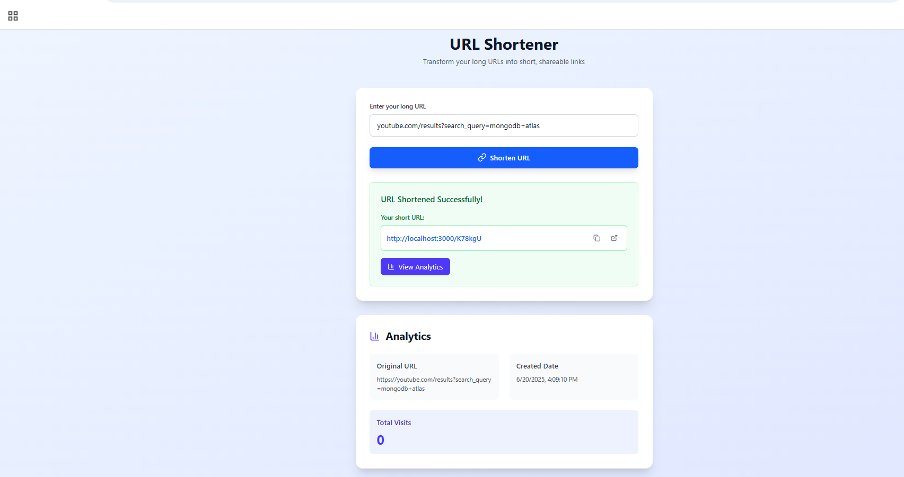

Here's a full `README.md` file for your **URL Shortener API** project. It includes:

*  Project goal
*  File structure
*  Route explanations
*  Setup instructions

```markdown
#  URL Shortener API

A simple URL shortening backend service (like Bitly) built using **Node.js**, **Express**, and **MongoDB**.

##  Project Goal

The goal of this project is to create a backend REST API that:
- Accepts a long URL and returns a shortened URL
- Redirects to the original URL when a short code is accessed
- Tracks the number of times each short URL has been used
- Stores the creation timestamp for each URL
- Ensures each short code is unique
- Validates user input

---

##  File Structure

```

url-shortener-api/
│
├── models/
│   └── Url.js               # Mongoose schema for storing URL data
│
├── routes/
│   └── urlRoutes.js         # Express route definitions
│
├── controllers/
│   └── urlController.js     # Logic for handling API endpoints
│
├── utils/
│   └── generateCode.js      # Utility to generate random short codes
│
├── .env                     # Environment variables (BASE\_URL, MONGO\_URI, PORT)
├── index.js                 # Main server entry point
├── README.md                # Project documentation

````

---

##  API Endpoints

### 1. `POST /shorten`

**Create a short URL**

- **Request Body:**
```json
{
  "longUrl": "https://www.youtube.com/results?search_query=mongodb+atlas"
}
````

* **Response:**

```json
{
  "shortUrl": "http://localhost:3000/abc123"
}
```

---

### 2. `GET /:code`

**Redirect to the original long URL**

* **Example Request:**

```
GET http://localhost:3000/abc123
```

* **Result:**

  * Redirects to the original URL
  * Increments visit count

---

### 3. `GET /stats/:code`

**Get statistics for a short URL**

* **Example Request:**

```
GET http://localhost:3000/stats/abc123
```

* **Response:**

```json
{
  "longUrl": "https://example.com/your-long-url",
  "createdAt": "2025-06-16T09:00:00.000Z",
  "visitCount": 4
}
```

---

## ⚙️ Setup Instructions

1. **Clone the repository**

```bash
git clone https://github.com/your-username/url-shortener-api.git
cd url-shortener-api
```

2. **Install dependencies**

```bash
npm install
```

3. **Create a `.env` file in the root**

```env
PORT=3000
MONGO_URI=mongodb://localhost:27017/urlshortener
BASE_URL=http://localhost:3000
```

4. **Start the server**

```bash
node index.js
```

Server runs at: [http://localhost:3000](http://localhost:3000)

---

## 🔧 Technologies Used

* Node.js
* Express.js
* MongoDB & Mongoose
* dotenv
* validator

---